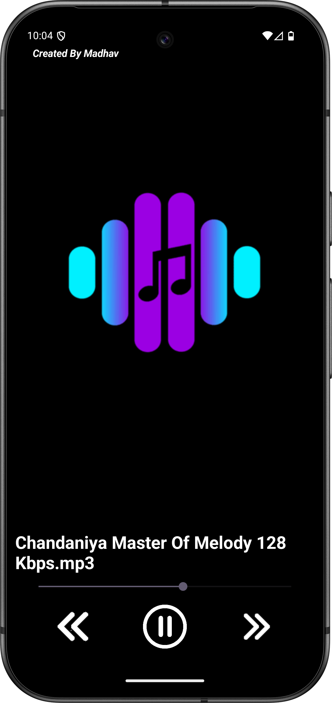

# 🎵 Sangeet – Your Local Music Player

**Sangeet** is a simple and elegant offline music player app for Android, built using native Android tools (Java + XML). It allows users to browse and play audio files stored locally on their device with ease.

---

## 📱 Features

- 🎼 Automatically fetches and lists all `.mp3` audio files on the device
- ▶️ Play, pause, and switch between songs
- 📃 Dynamic ListView of available songs
- 📀 Background music support 
- 💡 Clean and minimalistic UI
- 🐦‍⬛ Black clean UI

---

## 🛠️ Tech Stack

- **Language**: Java  
- **UI Design**: XML Layouts  
- **IDE**: Android Studio  
- **Libraries**: Android MediaPlayer, File access

---
## 🧑‍💻 Author
- [Madhav Gadge](https://github.com/madhavgadge01)
- [mail](madhavgadge01@gmail.com)
- [Linkdin](https://www.linkedin.com/in/madhav-gadge-610177343?utm_source=share&utm_campaign=share_via&utm_content=profile&utm_medium=android_app)

---
## 📸 Screenshots

| Playing |
|-------------|
|  |

